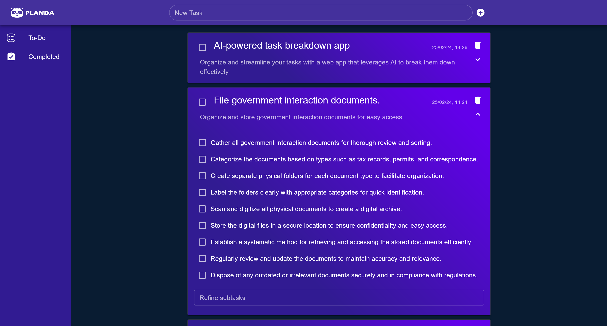

# Planda
Planda is an AI-Powered Task Management Application that aims to alleviate the most difficult part of any task - starting! Planda allows you to place an entry on your to-do list and uses a Large Language Model to analyse and break it down into more manageable sub-tasks. This means that instead of being overwhelmed and procrastinating the items on your agenda, you can use Planda to alleviate the difficulty of structuring your tasks by ticking off the easier sub-tasks to track your progress.

## This repository contains the code for Planda's backend functionality
You will not be able to run this code without a `.env` file in your cloned repository which contains a valid OpenAI API key. If you have this requirement, you will need to ensure python is installed before opening a terminal in your local repository directory and running `pip3 install -r requirements.txt` to install the dependencies, followed by `python3 app.py` to run the backend script.

_Planda was made by a team of Third Year Computer Science students over the course of a single weekend during the Hack Trinity event of 2024._
